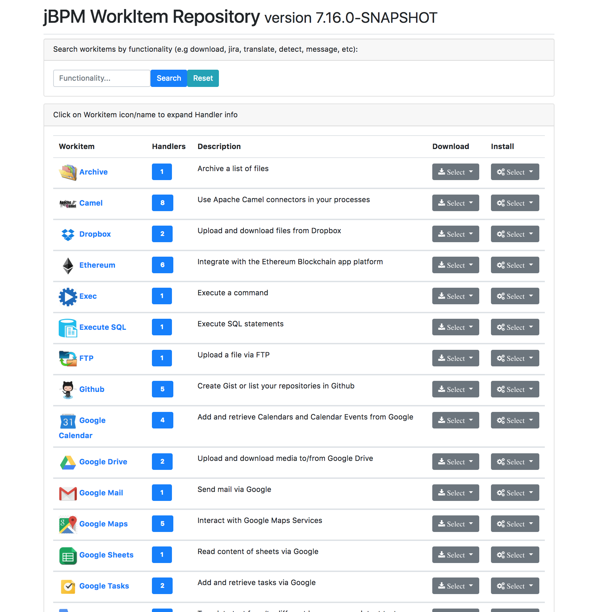
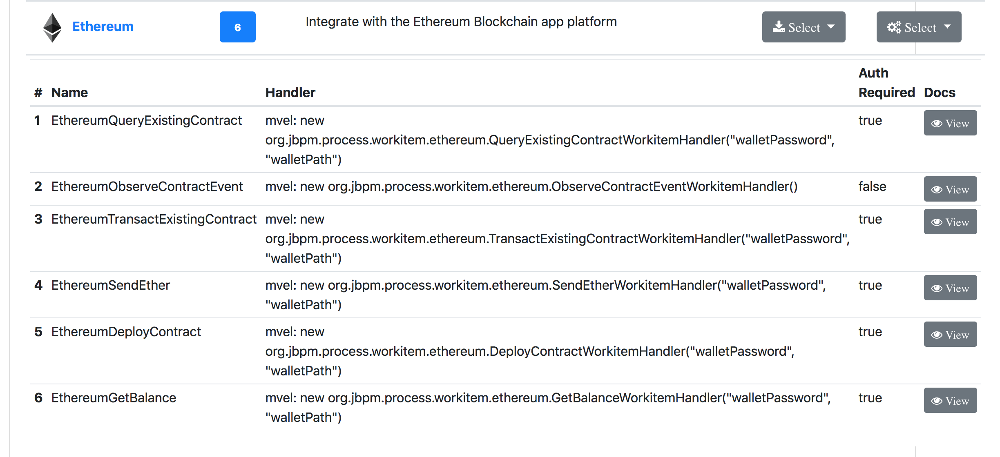
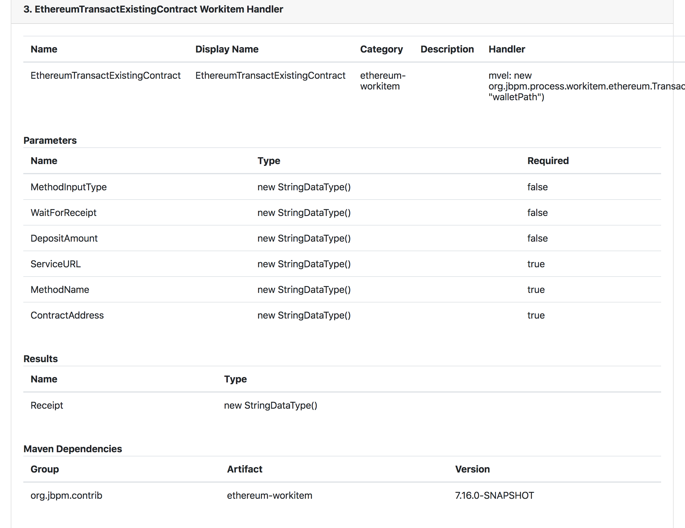
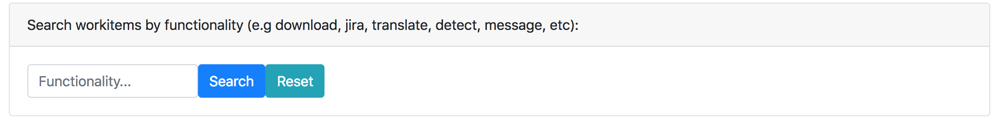
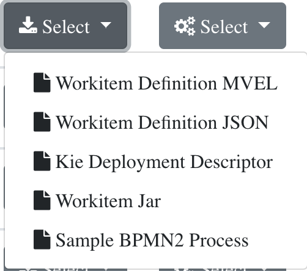
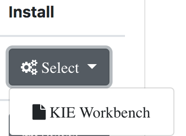

# jBPM WorkItem Repository
Collection of jBPM workitem (service task) implementations which you can use in your
business processes to integrate with different services. 



# Hosting the repository
Workitem Repository can be hosted in three different modes:

1) **File System mode**: 
Clone this github repo:
```
git clone https://github.com/kiegroup/jbpm-work-items.git
```
and build it:
```
cd jbpm-work-items
mvn clean install
```
then you can point your browser directly to for example:
```
file://PATH_TO_WORKITEM_REPO/repository/target/repository-VERSION
```
where VERSION is the version of the workitem repository you have built locally. 
You can also copy the contents of this directory anywhere else and access its contents from there.

2) **Spring Boot app**:
Clone this github repo:
```
git clone https://github.com/kiegroup/jbpm-work-items.git
```
and build it:
```
cd jbpm-work-items
mvn clean install
```
now you can start the repo as a spring-boot application:
```
cd repository-springboot
mvn spring-boot:run
```
and can access your repository with
```
http://localhost:8090/repository/
```

3) **Embedded WidlFly**:
Clone this github repo:
```
git clone https://github.com/kiegroup/jbpm-work-items.git
```
and build it:
```
cd jbpm-work-items
mvn clean install
```
get the repository server zip and extract it somewhere
(this creates a tmp directory in /target, you would want to unzip it somewhere else maybe)
```
cd repository-wildfly/target/
mkdir tmp
cd tmp
unzip ../repository-server-VERSION.zip
```
where VERSION is the version of the repository you have built locally
Now you can start your repo in wildfly
```
cd bin
./standalone.sh  (or standalone.bat for windows)
```
and access it in your browser with:
```
http://localhost:8080/repository/
```

# Workitem Display and Documentations
Repository displays all available workitems. Clicking on the workitem name (e.g "Google Maps")
will display all the workitem handlers associated with that workitem:




Clicking on the "View" button next to each of the handlers will show you documentation for that handler:




# Workitem Search by functionality
The repository allows your users to search its content by functionality:



This will filter your workitem display to only those which include the searched term

# Downloading workitem artifacts
For each workitem displayed the repository has a Downloads dropdown where you can easily get
all the needed artifacts for that workitem:




# Installing onto workbench
Note this is an experimental functionality and you will need to read the blog post:
http://mswiderski.blogspot.com/2018/07/easy-workitem-installation-jbpm.html
for more info. 




# Repository REST api
If hosted as spring-boot app or wildfly app the repository exposes a rest api for querying. 
It includes the following endpoints:
```
/repository/rest/services
/repository/rest/services/{name}
/repository/rest/services/{name}/parameters
/repository/rest/services/{name}/results
/repository/rest/services/{name}/mavendepends
/rest/services/category/{category}
/rest/servicetriggers
/rest/servicetriggers/count
/rest/serviceactions
/rest/serviceactions/count
```

# Contributing
**Yes Please!! :)**

We are always looking for contributions from the community.
If you would like to contribute your integration service (workitem) the best 
way is to look at some of the existing ones and pretty much copy its structure
and go from there. We are available on google groups:
https://groups.google.com/forum/#!forum/jbpm-setup 
for help and will help to
get you started and guide you through the contribution process. 

.
