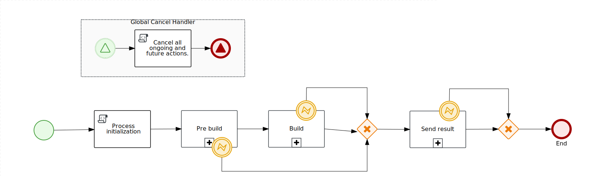
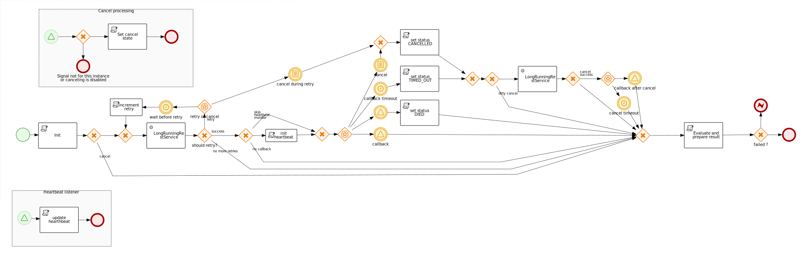

Long running REST work item handler
===================================


Feature set
===========
- Simple process definition (one box per operation)
- Tailored for long-running tasks
    - Http request, http callback
- Internally handled (graceful) timeout
- Internally handled (graceful) cancel
- Internal request retry 
- Completion status conditional execution (success/failed/timeout/cancel) 

A process example from the test cases



Task Definition
===============

Sub-process input parameters, to configure the remote service invocation. (* = mandatory parameter)

- Request (request to start remote task)
  - requestUrl*
  - requestMethod*
  - requestHeaders
  - requestTemplate (request body)
  - maxRetries (default 0 - disabled)
  - retryDelay (default 0)
- Cancel (request to cancel remote task)
  - cancelUrlJsonPointer (json path to extract cancel url form the invocation response)
  - cancelUrlTemplate (alternative to cancelUrlJsonPointer)
  - cancelMethod
  - cancelHeaders
  - cancelTimeout (time to wait for a graceful cancel)
  - ignoreCancelSignals (remote task is invoked also when cancel has been requested, useful for sending the final result of the process)
- successEvalTemplate* (boolean condition to determine task completion status)
- noCallback (task result is send as invocation response, default: false)
- taskTimeout* (time to wait for remote result before triggering cancel)
- heartbeatTimeout (mark service as DIED when there is no heart-beat, disabled if not set)
- socketTimeout (maximum inactivity period between two consecutive data packets in milliseconds, default 5000, 0 = infinite)
- connectTimeout (timeout in milliseconds until a connection is established, default 5000, 0 = infinite)
- connectionRequestTimeout(timeout in milliseconds used when requesting a connection from the connection manager, default 5000, 0 = infinite)

Request template
================
Is a message body sent when invoking remote task.
In the template you can use process input parameters, values from other task results and predefined _system_ variables, eg. `org.jbpm.process.longrest.util.ProcessUtils.getSystemVariables().getCallbackUrl()`
For an example see `org.jbpm.contrib.longrest.bpm.TestFunctions.getPreBuildTemplate()`.

**System variables**
- callbackUrl
- callbackMethod
- heartBeatUrl
- heartBeatMethod

**Including whole object map**
Note that all values are stored as nested maps, 
to include the whole object in the template you have to serialize it and to unescape it, to prevent double json escape.
Use `org.jbpm.contrib.longrest.util.Mapper().writeValueAsString(object, true)` to unescape the serialized object.
See `org.jbpm.contrib.longrest.bpm.TestFunctions.getCompletionTemplate()`.


Task Result
===========
Based on the result of a `successEvalTemplate` the task exits normally or exceptionally.
In both cases a `result` Map<String, Object> is available, with keys:
- status
  - SUCCESS
  - FAILED (when successEvalTemplate returns false)
  - CANCELLED
  - TIMED_OUT
  - DIED
  - SYSTEM_ERROR
- initialResponse (invocation response, de-serialized as Map<String, Object>)
- callbackResponse (de-serialized as Map<String, Object>)
- response (callbackResponse or initialResponse, depends on noCallback parameter)
- cancelResponse (response of the cancel invocation, de-serialized as Map<String, Object>)
- error

Result example:
```
{
    status=SUCCESS,
    response={
        scm={
            url=https://github.com/kiegroup/jbpm-work-items.git, 
            revision=new-scm-tag
        }, 
        status=SUCCESS
    }, 
    callbackResponse={
        scm={
            url=https://github.com/kiegroup/jbpm-work-items.git, 
            revision=new-scm-tag
        }, 
        status=SUCCESS
    }, 
    initialResponse={
        cancelUrl=http://localhost:8080/demo-service/cancel/0?delay=1
    }, 
    cancelResponse=null, 
    error=null
}
```
- note it's a nested map not a json
- there are multiple `status` fields, the top-level one is the result of the "process" task, 
  while the one under the response is the result which has been returned from the remote service and coincidently has the same name
- we see that the `response` is the same as `callbackResponse`, that's because `noCallback` has not been set


Task invocation details
=======================
The execute-rest sub-process is used to start the remote task and wait for its completion either by a http response or an async callback.

If the task invocation fail due to an error and the `maxRetries` is greater than 0 the invocation is re-tried. 
The invocation retry is delayed for `retryDelay * retryAttempt` millis.

When the operation cancel request is received, the remote task is tried to be gracefully cancelled by invoking the cancelUrl which is defined by `cancelUrlJsonPointer` or `cancelUrlTemplate`.
If the `cancelTimeout` is reached, the graceful cancel attempt is ignored. The task completes with status "CANCELLED" regardless of the success of graceful cancel.

If the `taskTimeout` is reached, the cancel procedure is triggered. The task completes with status "TIMED_OUT".

When the process is waiting for a callback, there is an active internal heart-beat monitor (enabled by setting a `heartbeatTimeout`), 
if the time-out is reached, the task completes with status "DIED".

When everything goes well the final status "SUCCESS" or "FAILED" is determined based on boolean condition defined in `successEvalTemplate`.
Sample template: `@{status=="SUCCESS"}`, where a `status` field is a field in the result's response (from a remote task).

Implementation detail (execute-rest sub-process)



## Error handling

execute-rest sub-process error exit conditions:
- `successEvalTemplate` evaluates to `false`
- `taskTimeout` is reached
- `heartbeatTimeout` is reached
- cancel requested
- communication error with remote service

When any of the error exit conditions happen the error completion event can be caught with an error catching boundary event of type `operationFailed`. 

## Heart-beat

Hearth-beat monitor is integrated in the execute-rest sub-process. It is enabled by setting the `heartbeatTimeout` variable.
When enabled a remote task has to periodically notify the process that the task is still running.
The url to send the beat is provided by the system variables `system.heartBeatUrl` and `system.heartBeatMethod` that can be used in the remote task invocation template.


Setting up
==========
Upload this work item handler to your JBPM server and import the `execute-rest.bpmn` (src/main/resources/execute-rest.bpmn) process as an asset to your project.

Heartbeat monitor requires a global reoccurring command HeartbeatMonitorCommand. Upload the `long-running-rest-workitem-VER-heartbeat-command.jar` to kie server `$eap-home/standalone/deployments/ROOT.war/WEB-INF/lib`
and start the job `org.jbpm.process.longrest.HeartbeatMonitorCommand` using web console (manage / jobs) or REST endpoint.
By default, the validation runs every 5 seconds it can be changed by setting the job parameter `heartbeatValidation` (java duration format, default: 'PT5S').

To design your task invocation process use the execute-rest as a sub-process.

See a usage example in `src/test/resources/test-process.bpmn` and `org.jbpm.contrib.longrest.bpm.TestFunctions`.

## Environment set-up

To generate a callback urls a WIH needs a kie hostname, it has to be set as the environment variable or a java system property, 
where system property overrides the environment variable and `HOSTNAME_HTTPS` has a priority over `HOSTNAME_HTTP`.

Look-up order (first found is used):
```
- System.getProperty("HOSTNAME_HTTPS")
- System.getProperty("HOSTNAME_HTTP")
- System.getenv("HOSTNAME_HTTPS")
- System.getenv("HOSTNAME_HTTP")
```
