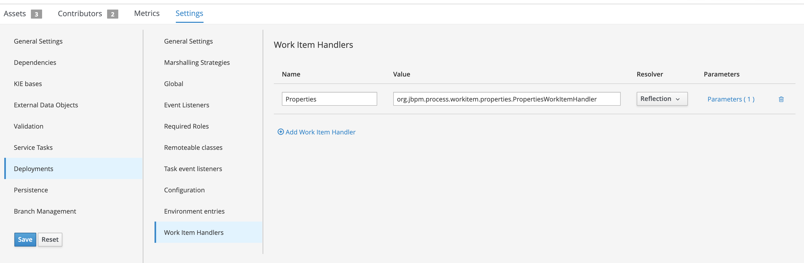
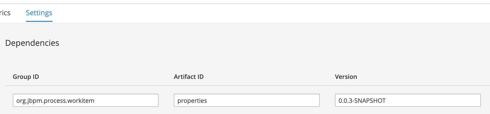
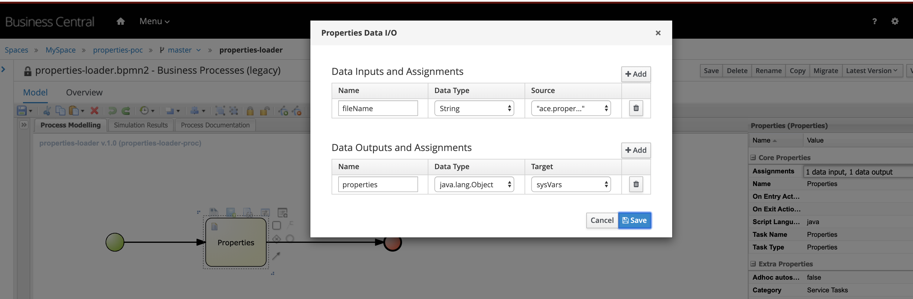

# Installation
1. Git clone this repo
2. Run `mvn clean install`
3. Upload `target/properties-loader-<version>` to Business Central artifact repo
4. Configure your PAM project settings:
	* Dependencies > add `org.jbpm.process.workitem:properties-loader:<version>`  

## PropertiesWorkItemHandler
A work item that reads a java properties file from disk.
### Install
1. Add work item handler: `org.jbpm.process.workitem.properties.PropertiesWorkItemHandler` (Resolver: Reflection, NOT MVEL), add parameter `String directory` to point to directory where properties files are stored.  

2. Import WorkItemDefinition file `/src\main/resources/META-INF/PropertiesWorkItemDefinition.wid`
3. Add dependency of type `org.jbpm.process.workitem:properties:0.0.3-SNAPSHOT`

### How to use
Add the `Properties` work item to your business process, assign properties file name to the `fileName` input parameter and assign output parameter `properties` a process variable of type `java.util.Map`.
